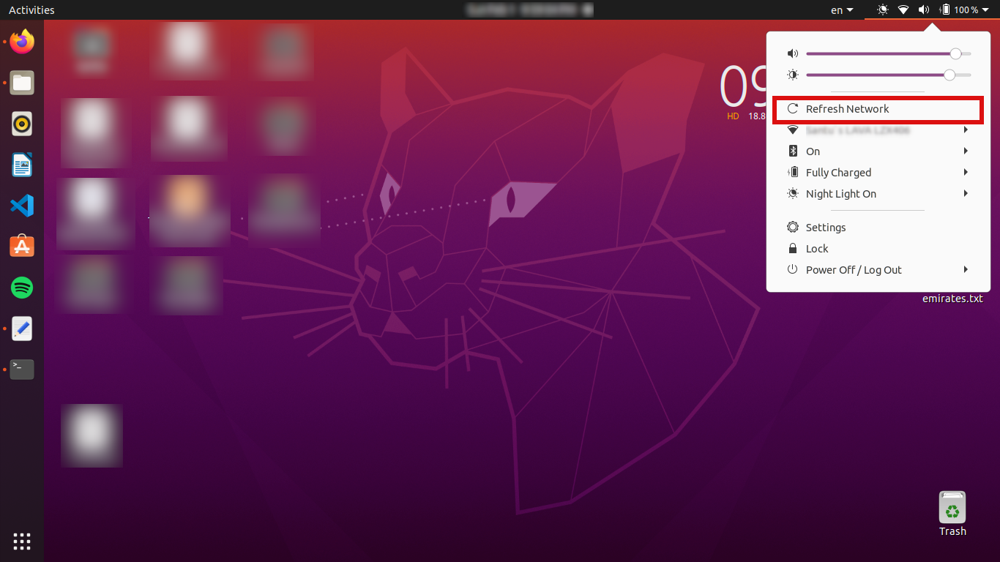

# 🔄 WiFi Refresh Button for GNOME (Ubuntu 20.04)

A lightweight GNOME Shell extension that adds a **Refresh Network**
button directly inside the Wi-Fi menu.\
It allows users to quickly rescan Wi-Fi networks and automatically
reconnect to known networks --- without reopening the network menu.

Designed specifically for **Ubuntu 20.04 (GNOME 3.36)**.

------------------------------------------------------------------------

## ✨ Features

-   ✅ Adds **Refresh Network** button inside the Wi-Fi menu
-   📶 Rescans available Wi-Fi networks instantly
-   🔁 Automatically reconnects to known networks
-   🎨 Native GNOME icon and theme integration
-   🧩 Seamless integration with GNOME system menu
-   ⚡ Lightweight and fast (no background services)

------------------------------------------------------------------------

## 🖼 Screenshot



------------------------------------------------------------------------

## 📦 Installation

There are two main ways to install the **WiFi Refresh Button**
extension:

### 🔹 Method 1: Manual Installation (Recommended)

1.  **Clone the repository:**

``` bash
git clone https://github.com/yoursantu/gnome-wifi-refresh.git
```

2.  **Copy the extension folder to GNOME extensions directory:**

``` bash
mkdir -p ~/.local/share/gnome-shell/extensions/
cp -r wifi-refresh@techindu.com ~/.local/share/gnome-shell/extensions/
```

3.  **Enable the extension:**

``` bash
gnome-extensions enable wifi-refresh@techindu.com
```

4.  **Restart GNOME Shell**

``` bash
killall -SIGTERM gnome-shell
```

5.  **Enjoy!**\
    Click the Wi-Fi icon in the top panel → see the new **Refresh
    Network** button.

------------------------------------------------------------------------

### 🔹 Method 2: ZIP Installation

1.  Download the ZIP from GitHub Releases.\
2.  Extract it to:

```{=html}
<!-- -->
```
    ~/.local/share/gnome-shell/extensions/

3.  Enable the extension:

``` bash
gnome-extensions enable wifi-refresh@techindu.com
```

4.  Restart GNOME Shell:

``` bash
killall -3 gnome-shell
```

------------------------------------------------------------------------

## 🚀 Usage

1.  Click on the Wi-Fi icon in the top panel.\
2.  Click **Refresh Network**.\
3.  GNOME will rescan networks and reconnect automatically to the first
    known network.

> **Note:** The menu will close automatically after clicking, showing
> GNOME's native connection animation.

------------------------------------------------------------------------

## 🧠 Notes

-   Requires **Ubuntu 20.04 LTS** with **GNOME 3.36**
-   Uses **NetworkManager (`nmcli`)** commands internally
-   The extension is lightweight and does not run background processes
-   Tooltips inside the GNOME system menu are not supported due to GNOME
    limitations

------------------------------------------------------------------------

## 🔧 Compatibility

| OS           | GNOME Version | Status          |
|--------------|---------------|-----------------|
| Ubuntu 20.04 | 3.36          | ✅ Supported    |
| Ubuntu 22.04 | 42+           | ⚠️ Experimental |
| Ubuntu 24.04 | 46+           | ⚠️ Experimental |


## 🤝 Contributing

Contributions are welcome!

1.  Fork the repository\
2.  Create a feature branch (`git checkout -b feature-name`)\
3.  Commit your changes (`git commit -m "Add feature"`)\
4.  Push the branch (`git push origin feature-name`)\
5.  Submit a pull request

------------------------------------------------------------------------

## 📜 License

MIT License\
See `LICENSE` file for details.

------------------------------------------------------------------------

## 👨‍💻 Author

**Santosh Hegde**\
TechIndu\
🌐 https://techindu.com

------------------------------------------------------------------------

## ⭐ If you find this useful

Give this repo a ⭐ on GitHub!
